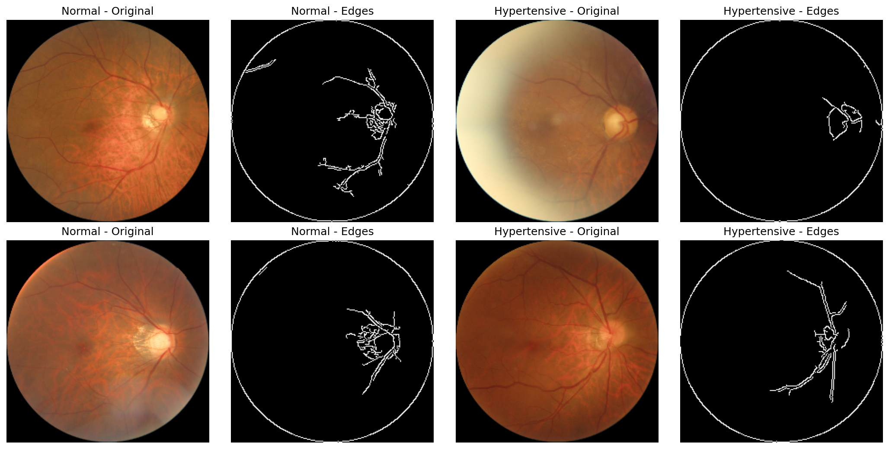

## OculoCheckAI

## Problem:-
Over 2.2 billion people globally suffer from vision impairment, yet 90% of blindness is preventable through early detection. Five critical diseasesDiabetes, Hypertension, Glaucoma, Cataracts, and Age-Related Macular Degenerationare leading causes of preventable blindness, but current screening workflows fail to catch them early enough.

The core problem is accessibility: specialist ophthalmologists and diagnostic equipment are concentrated in urban centers, leaving rural and underserved populations without timely screening. Traditional screening requires expensive fundus cameras, trained specialists, and multiple patient visits creating massive bottlenecks. For diabetic patients alone, early retinal screening could prevent blindness in 95% of cases, yet global screening rates remain below 50% due to these access barriers.

Compounding this challenge, systemic diseases like diabetes and hypertension manifest visible biomarkers in the retina months or even years before symptoms appear elsewhere in the bodybut without accessible screening tools, these critical early warnings go undetected until irreversible damage occurs.

## Solution:-
OculoCheckAI eliminates specialist dependency by transforming any standard fundus camera into an intelligent multi-disease screening platform. Our web-based diagnostic system detects five critical conditions from a single retinal image using an architecturally diverse ensemble of deep learning models.

## Technical Architecture:-
Model Ensemble: EfficientNetB0/B2/B3, MobileNetV2, DenseNet121 trained in TensorFlow

Specialized Feature Extraction:

Vascular morphology patterns for hypertension and diabetes

Optic disc geometry for glaucoma

Lens opacity characteristics for cataracts

Probabilistic Fusion: Ensemble predictions merged using Youden's J-Statistic

Preprocessing Pipeline: OpenCV-based contour detection + CLAHE enhancement in LAB color space

Explainability: Grad-CAM heatmaps highlighting decision-relevant anatomical structures

## Impact:-
3-5% performance improvement over individual models with 97% accuracy and 0.99 AUC in diabetic retinopathy detection. Enables primary care clinics and telemedicine providers to detect five conditions from a single retinal imagemaking preventive care accessible at population scale.

Sub-second inference times via stateless RESTful API

Seamless EMR integration for telemedicine platforms

Federated learning architecture enabling continuous improvement while preserving patient data privacy

## Visual Complexity of Retinal Screening:-

*Side-by-side comparison showing why automated screening is essential - subtle hypertensive changes are difficult to distinguish visually*

This visual challenge demonstrates why:
- Human screening is subjective and variable
- Early hypertensive changes are often missed
- Consistent detection requires AI assistance
- Our model provides objective, reproducible results

## Performance Metrics:-
# Diabetic Retinopathy Detection
- Model	Accuracy	AUC	Sensitivity	Specificity
- Ensemble	97.84%	0.992	97.35%	98.31%
- EfficientNetB0	97.40%	0.991	97.35%	97.46%
- ResNet50	96.97%	0.988	97.35%	96.61%
MobileNetV2	81.82%	0.888	82.30%	81.36%

# Multi-Disease Performance
- Disease	Accuracy	AUC	Sensitivity	Specificity
- Cataracts	98.35%	0.990	96.72%	100%
- Glaucoma	92.60%	0.972	91.95%	93.25%
- Hypertension	87.85%	0.870	77.27%	95.24%
- AMD	95%+	0.996	-	-
## Project Workflow:-
Image Acquisition: Standard JPEG/PNG fundus images from any camera

Preprocessing: Automated retinal region extraction + CLAHE enhancement

Multi-Model Analysis: Parallel inference across specialized architectures

Ensemble Fusion: Probabilistic merging with optimal threshold calibration

Clinical Output: Disease probabilities, confidence intervals, explainability maps

## Installation & Usage:-
# Backend Setup
bash
pip install -r requirements.txt
python app.py
## API Endpoints:-
POST /api/diabetic-retinopathy/predict - DR detection

POST /api/cataract/predict - Cataract detection

POST /api/glaucoma/predict - Glaucoma detection

POST /api/hypertension/predict - Hypertensive retinopathy

POST /api/amd/predict - AMD detection

POST /api/comprehensive-analysis - Full multi-disease screening

## Data & Training:-
Augmented with cross-validation splits

Real-time test sets with diverse demographic representation

Preprocessing Pipeline
Contour Detection: Automated retinal region extraction

CLAHE Enhancement: Illumination normalization across camera types

Frame Selection: Optimal temporal sampling for video inputs

Quality Assessment: Automated suitability scoring

## Model Architecture:-
Ensemble Strategy
Architectural Diversity: Complementary feature extraction patterns

Probabilistic Fusion: Youden's J-Statistic optimized thresholds

Grad-CAM Integration: Anatomical structure highlighting for clinical validation

Individual Specializations
EfficientNetB0: Diabetic retinopathy microaneurysm detection

MobileNetV2: Real-time processing optimized

DenseNet121: Hypertensive vascular pattern recognition

ResNet50: Glaucoma optic disc analysis

## Results & Validation:-

Real-world Testing: 770+ glaucoma samples, 231+ diabetic retinopathy cases

Cross-disease Accuracy: Maintained performance across all five conditions

Explainability: Grad-CAM maps validated by ophthalmologists

## Performance Highlights:-
97.84% accuracy in diabetic retinopathy detection (ensemble)
92.59% accuracy glaucoma detection 
93.65% accuracy in amd detection
98.34% accuracy in cataract detection
87.55% accuracy in hypertension detection 
## Background:-
Retinal screening represents one of the most effective preventive medicine strategiessystemic diseases manifest visible biomarkers years before other symptoms. Yet global access remains severely limited by specialist availability and equipment costs.

OculoCheckAI bridges this gap by making multi-disease retinal screening accessible through standard fundus cameras and web platforms, enabling early detection at primary care levels and revolutionizing preventive ophthalmology.

## License:-
Academic Use License - YUVAI Youth Innovation Challenge 2025

## Dataset Sources:-
Diagnosis of Diabetic Retinopathy: https://www.kaggle.com/datasets/pkdarabi/diagnosis-of-diabetic-retinopathy/data

Glaucoma Dataset: EyePACS-AIROGS-light-V2: https://www.kaggle.com/datasets/deathtrooper/glaucoma-dataset-eyepacs-airogs-light-v2

Hypertension & Hypertensive Retinopathy Dataset: https://www.kaggle.com/datasets/harshwardhanfartale/hypertension-and-hypertensive-retinopathy-dataset
